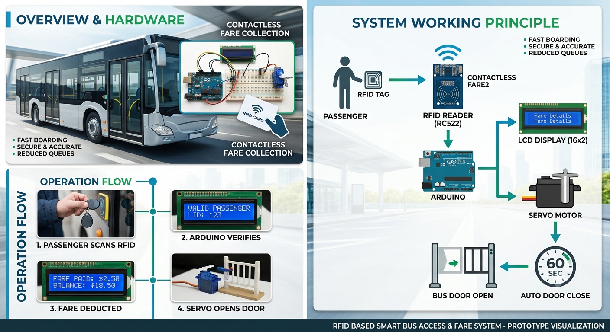

# RFID-Based-Smart-Bus-Access-and-Fare-System
RFID Based Smart Bus Access and Fare System uses RFID to identify passengers, process fare, and automatically control the bus door. A valid card opens the door using a servo motor, while the LCD displays the fare and status.
RFID Based Smart Bus Access & Fare System
​1. Introduction
​The RFID Based Smart Bus Access & Fare System is an automated prototype designed to modernize public transit operations. By integrating contactless identification, automatic fare deduction, and synchronized door control, the system eliminates traditional bottlenecks in manual ticketing and passenger boarding.  
​2. Problem Statement
​Manual Bottlenecks: Manual fare collection by conductors causes significant boarding delays and longer stoppage times.
​Cash & Paper Inconvenience: Managing paper tickets, cash exchanges, and exact change creates hassle for passengers and transit staff.
​Lack of Verification: Conventional systems lack an automated mechanism to identify passengers and verify ride permissions at the point of entry.
​Disjointed Door Control: Physical door operations are typically decoupled from fare verification, posing safety risks and unauthorized entry points.
​3. Proposed Solution
​The proposed architecture employs Radio Frequency Identification (RFID) paired with an Arduino microcontroller to automate transit entry and payment workflows:
​Passengers are issued a pre-configured RFID card or key fob containing a unique identifier (UID).
​Boarding passengers scan their card at the bus entrance RFID terminal.
​The system validates the passenger, automatically deducts the designated fare, provides immediate transaction feedback, and actuates the vehicle door.
​4. Hardware Components
​Arduino UNO: The core microcontroller that manages system logic, sensor communication, and actuator triggering.
​RFID RC522 Reader Module: A 13.56 MHz high-frequency reader interface that detects and reads the UID from passenger cards.
​RFID Cards / Keychains: Passive tags storing unique passenger credentials.
​16×2 I2C LCD Display: Displays real-time passenger details, deducted fares, and remaining balances.
​Servo Motor: Acts as the physical door actuator to open and close the entrance gate.
​Breadboard & Jumper Wires: Facilitates prototype circuit connections and power distribution.
​5. Working Principle
​Card Scanning: A passenger taps their RFID tag on the RC522 reader module at the bus doorway.
​UID Retrieval: The RC522 reads the tag’s unique identifier and transmits the serial data to the Arduino UNO.
​Data Verification: Arduino verifies whether the UID is registered and contains sufficient travel balance.
​Fare Deduction: The preset fare is subtracted from the passenger’s account balance.
​LCD Feedback: The 16×2 display shows the passenger's name, fare deducted, and updated remaining balance.
​Door Operation: The servo motor rotates to unlatch/open the entrance door.
​Timed Latching: The door remains open for 60 seconds to allow the passenger to board safely, after which the servo automatically closes the door.
​6. Key Advantages
​Contactless & Fast: RFID tapping requires less than a second, expediting boarding and eliminating ticketing queues.
​Seamless Automation: Unifies payment verification with motorized door access without conductor intervention.  
​Transparent Transactions: The passenger receives immediate visual confirmation of the deducted fare and account status via LCD.
​Cost-Effective & Scalable: Built on accessible, low-cost embedded hardware that can be scaled to support larger fleets or integrate IoT/GPS tracking.
​7. Applications
​City & Local Transit: Urban bus routes and transit feeder networks.
​Educational Institutions: College and school buses for automated student tracking and safe transit.
​Corporate Fleets: Company staff transport and restricted-access shuttles.
​Smart Cities: Rapid transit systems and automated public transportation prototypes.
​8. Conclusion
​The RFID Based Smart Bus system establishes an efficient, low-cost prototype for next-generation automated public transit. By consolidating identity authentication, balance deduction, and physical access control into a unified embedded framework, it provides a safe, transparent, and passenger-friendly alternative to manual fare handling.  

